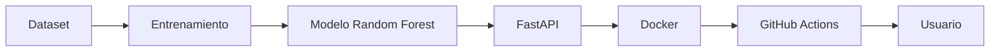
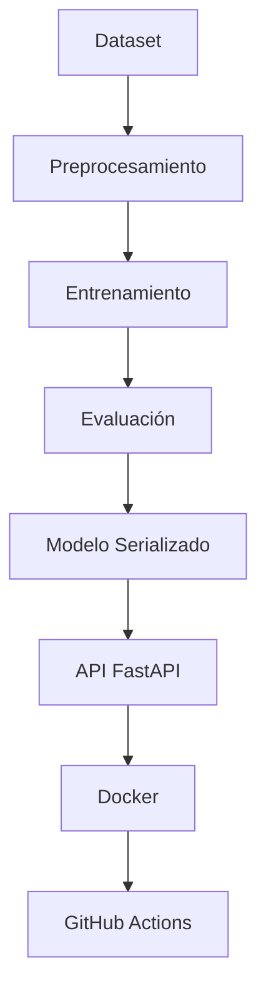
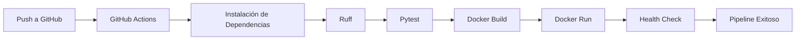

# 🧠 API de Predicción del Nivel de Obesidad

## 🚀 Proyecto de MLOps con FastAPI, Docker y GitHub Actions


---

# 📖 Descripción del Proyecto

Este proyecto implementa una solución completa de **Machine Learning** siguiendo principios de **MLOps (Machine Learning Operations)** para predecir el **nivel de obesidad** de una persona utilizando variables antropométricas y hábitos de vida.

La solución fue desarrollada con un enfoque orientado a producción, integrando herramientas ampliamente utilizadas en la industria para el despliegue y mantenimiento de modelos de Machine Learning.

El proyecto contempla todo el ciclo de vida de un modelo:

- 📊 Preparación de datos
- 🤖 Entrenamiento del modelo
- 💾 Serialización del modelo
- 🌐 Exposición mediante API REST
- 📑 Documentación automática
- 🧪 Pruebas automatizadas
- 🐳 Contenerización con Docker
- ⚙️ Integración Continua mediante GitHub Actions

---

# 🎯 Objetivos

Los principales objetivos del proyecto son:

- Implementar un modelo de Machine Learning para clasificación.
- Exponer el modelo mediante una API REST utilizando FastAPI.
- Automatizar las pruebas unitarias.
- Documentar automáticamente la API mediante Swagger.
- Contenerizar la aplicación utilizando Docker.
- Automatizar el proceso de validación mediante GitHub Actions.
- Aplicar buenas prácticas de desarrollo y MLOps.

---

# 📚 Tabla de Contenidos

- [📖 Descripción del Proyecto](#-descripción-del-proyecto)
- [🎯 Objetivos](#-objetivos)
- [🏗 Arquitectura General](#-arquitectura-general)
- [🔄 Flujo MLOps](#-flujo-mlops)
- [🛠 Tecnologías Utilizadas](#-tecnologías-utilizadas)
- [🤖 Modelo de Machine Learning](#-modelo-de-machine-learning)
- [📂 Estructura del Proyecto](#-estructura-del-proyecto)
- [📦 Instalación](#-instalación)
- [▶️ Ejecución Local](#️-ejecución-local)
- [🐳 Docker](#-docker)
- [🐳 Docker Compose](#-docker-compose)

---

# 📌 Resumen del Proyecto

| Característica | Estado |
|----------------|:------:|
| API REST | ✅ |
| Modelo entrenado | ✅ |
| Swagger | ✅ |
| Docker | ✅ |
| Docker Compose | ✅ |
| Pytest | ✅ |
| Ruff | ✅ |
| GitHub Actions | ✅ |

---

# 🏗 Arquitectura General



La arquitectura separa claramente el entrenamiento del modelo y la inferencia, permitiendo reutilizar el modelo entrenado sin necesidad de volver a entrenarlo.

---

# 🔄 Flujo MLOps



---

# 🛠 Tecnologías Utilizadas

| Tecnología | Descripción |
|------------|-------------|
| 🐍 Python 3.10 | Lenguaje de programación |
| ⚡ FastAPI | Framework para la API REST |
| 📊 Pandas | Manipulación de datos |
| 🤖 Scikit-Learn | Entrenamiento del modelo |
| 🧪 Pytest | Pruebas automatizadas |
| 🎨 Ruff | Calidad del código |
| 🐳 Docker | Contenerización |
| 📦 Docker Compose | Orquestación local |
| ⚙️ GitHub Actions | Integración Continua |
| 🚀 Uvicorn | Servidor ASGI |

---

# 🤖 Modelo de Machine Learning

El modelo fue desarrollado utilizando **Scikit-Learn**, implementando un algoritmo de clasificación basado en **Random Forest Classifier**.

## 📥 Variables de Entrada

- Gender
- Age
- Height
- Weight
- family_history
- FAVC
- FCVC
- NCP
- CAEC
- SMOKE
- CH2O
- SCC
- FAF
- TUE
- CALC
- MTRANS

## 🎯 Variable Objetivo

```
Obesity
```

## 📈 Algoritmo Utilizado

- Random Forest Classifier

## 📦 Artefactos Generados

```
models/

├── model.pkl
├── encoders.pkl
└── metadata.json
```

### model.pkl

Modelo entrenado listo para realizar predicciones.

### encoders.pkl

Codificadores utilizados para transformar variables categóricas.

### metadata.json

Archivo que almacena información del modelo:

- Accuracy
- Variables utilizadas
- Variable objetivo
- Parámetros del entrenamiento

---

# 📂 Estructura del Proyecto

```text
obesity-ml-cloud-api/

│

├── app/
│   ├── __init__.py
│   ├── main.py
│   ├── predictor.py
│   └── schemas.py
│
├── training/
│   └── train.py
│
├── tests/
│   └── test_api.py
│
├── models/
│   ├── model.pkl
│   ├── encoders.pkl
│   └── metadata.json
│
├── data/
│   └── Obesity_prediction.csv
│
├── .github/
│   └── workflows/
│       └── ci.yml
│
├── Dockerfile
├── docker-compose.yml
├── requirements.txt
└── README.md
```

---

# 📁 Descripción de Carpetas

| Carpeta | Descripción |
|----------|-------------|
| 📂 app | Implementación de la API REST |
| 🤖 training | Entrenamiento del modelo |
| 💾 models | Modelo entrenado y artefactos |
| 🧪 tests | Pruebas unitarias |
| 📊 data | Dataset utilizado |
| ⚙️ .github | Pipeline de GitHub Actions |

---

# 📦 Instalación

## 1️⃣ Clonar el repositorio

```bash
git clone https://github.com/cbarrientos-beep/obesity-ml-cloud-api.git

cd obesity-ml-cloud-api
```

---

## 2️⃣ Crear un entorno virtual

### Windows

```bash
python -m venv .venv

.venv\Scripts\activate
```

### macOS / Linux

```bash
python3 -m venv .venv

source .venv/bin/activate
```

---

## 3️⃣ Instalar dependencias

```bash
pip install -r requirements.txt
```

---

# ▶️ Ejecución Local

Levantar la API:

```bash
uvicorn app.main:app --reload
```

La aplicación estará disponible en:

```
http://localhost:8000
```

Swagger:

```
http://localhost:8000/docs
```

OpenAPI:

```
http://localhost:8000/openapi.json
```

---

# 🐳 Docker

## Construir la imagen

```bash
docker build -t obesity-api .
```

---

## Ejecutar el contenedor

```bash
docker run -p 8000:8000 obesity-api
```

---

# 🐳 Docker Compose

Para levantar todo el proyecto:

```bash
docker compose up --build
```

Para detener los servicios:

```bash
docker compose down
```

Docker Compose construye la imagen, inicia la API y deja disponible la documentación Swagger en el puerto **8000**.

---

# 🌐 Endpoints de la API

La API expone cinco endpoints principales que permiten consultar el estado del servicio, obtener información del modelo y realizar predicciones individuales o por lotes.

---

## 🏠 GET /

Retorna información general de la API.

### Request

```http
GET /
```

### Response

```json
{
    "message": "Obesity Prediction API",
    "version": "1.0.0"
}
```

---

## ❤️ GET /health

Permite verificar que la API y el modelo se encuentren correctamente cargados.

### Request

```http
GET /health
```

### Response

```json
{
    "status": "ok",
    "model_loaded": true
}
```

Este endpoint es utilizado por Docker y GitHub Actions para verificar el correcto funcionamiento del servicio.

---

## 📊 GET /model/schema

Entrega información del modelo entrenado.

### Request

```http
GET /model/schema
```

### Información retornada

- Variables utilizadas por el modelo.
- Variable objetivo.
- Accuracy del modelo.
- Cantidad de muestras utilizadas.
- Parámetros de entrenamiento.

---

## 🔮 POST /predict

Realiza una predicción individual.

### Request

```json
{
  "Gender": "Male",
  "Age": 25,
  "Height": 1.75,
  "Weight": 82,
  "family_history": "yes",
  "FAVC": "yes",
  "FCVC": 2,
  "NCP": 3,
  "CAEC": "Sometimes",
  "SMOKE": "no",
  "CH2O": 2,
  "SCC": "no",
  "FAF": 1,
  "TUE": 1,
  "CALC": "Sometimes",
  "MTRANS": "Public_Transportation"
}
```

### Response

```json
{
    "prediction": "Normal_Weight"
}
```

---

## 📦 POST /predict/batch

Permite enviar múltiples registros en una sola solicitud.

### Response

```json
{
    "predictions": [
        "Normal_Weight",
        "Overweight_Level_I"
    ]
}
```

---

# 📑 Documentación Swagger

FastAPI genera automáticamente la documentación interactiva.

Disponible en:

```
http://localhost:8000/docs
```

Además, el esquema OpenAPI puede consultarse en:

```
http://localhost:8000/openapi.json
```

Swagger permite:

- Visualizar todos los endpoints.
- Ejecutar pruebas directamente desde el navegador.
- Revisar ejemplos de Request y Response.
- Consultar el esquema completo de la API.

---

# 🧪 Pruebas Automatizadas

El proyecto incorpora pruebas unitarias utilizando **Pytest**.

Ejecutar:

```bash
python -m pytest tests/test_api.py -v
```

Las pruebas consideran los siguientes escenarios:

- ✅ Endpoint raíz.
- ✅ Endpoint Health.
- ✅ Consulta del esquema del modelo.
- ✅ Predicción válida.
- ✅ Campo obligatorio faltante.
- ✅ Valor categórico inválido.
- ✅ Predicción Batch.
- ✅ Batch con datos inválidos.
- ✅ Tipo de dato incorrecto.

Resultado esperado:

```text
=========================

9 passed

=========================
```

---

# 🎨 Calidad del Código

La calidad del código es validada mediante **Ruff**.

Ejecutar:

```bash
ruff check .
```

Corrección automática:

```bash
ruff check . --fix
```

---

# ⚙️ Integración Continua (CI/CD)

El proyecto incorpora un pipeline automático utilizando **GitHub Actions**.

Cada vez que se realiza un **Push** sobre la rama principal, el pipeline ejecuta automáticamente las siguientes tareas:

- Instalación de dependencias.
- Validación del código con Ruff.
- Ejecución de pruebas con Pytest.
- Construcción de la imagen Docker.
- Levantamiento del contenedor.
- Verificación del endpoint `/health`.

---

## 🔄 Flujo del Pipeline



---

# 🐳 Contenerización

La aplicación fue diseñada para ejecutarse completamente mediante Docker.

Ventajas:

- 📦 Portabilidad.
- 🔄 Reproducibilidad.
- 💻 Independencia del sistema operativo.
- 🚀 Facilidad de despliegue.

---

# 📊 Flujo de Predicción

```mermaid
flowchart LR

Cliente

-->

API FastAPI

-->

Validación

-->

Label Encoder

-->

Modelo Random Forest

-->

Predicción

-->

Respuesta JSON
```

---

# ✅ Buenas Prácticas Implementadas

Durante el desarrollo del proyecto se aplicaron distintas prácticas recomendadas para soluciones de Machine Learning:

- Arquitectura modular.
- Separación entre entrenamiento e inferencia.
- Serialización del modelo.
- Validación mediante Pydantic.
- Documentación automática con Swagger.
- Pruebas unitarias.
- Contenerización con Docker.
- Integración Continua.
- Control de calidad mediante Ruff.

---

# 🚀 Mejoras Futuras

Como trabajo futuro, el proyecto podría incorporar:

- 🔐 Autenticación mediante JWT.
- ☁️ Despliegue en Azure o AWS.
- 📈 Monitoreo del desempeño del modelo.
- 📊 Integración con MLflow.
- 🗄 Registro de predicciones en base de datos.
- 🔄 Reentrenamiento automático del modelo.
- 🚀 Pipeline de Continuous Deployment (CD).

---

# ⚠️ Troubleshooting

| Problema | Solución |
|-----------|----------|
| Swagger no carga | Verificar que la API esté ejecutándose. |
| Docker no inicia | Ejecutar `docker compose down` y luego `docker compose up --build`. |
| Error `ModuleNotFoundError` | Revisar la estructura del proyecto y el `PYTHONPATH`. |
| No encuentra `model.pkl` | Confirmar que exista dentro de la carpeta `models/`. |
| Fallan los tests | Ejecutar `python -m pytest tests/test_api.py -v`. |
| Error en GitHub Actions | Revisar el workflow `ci.yml` y los logs del pipeline. |

---

# 📌 Conclusiones

Este proyecto demuestra la implementación de un flujo completo de **MLOps** para un problema de clasificación utilizando Machine Learning.

La solución integra el entrenamiento del modelo, la exposición mediante una API REST, la documentación automática, las pruebas unitarias, la contenerización con Docker y la integración continua mediante GitHub Actions.

El resultado es una aplicación reproducible, escalable y preparada para ser desplegada en distintos entornos.

---

# 👨‍💻 Autor

**Cristóbal Barrientos**

Magíster en Ciencia de Datos

Universidad Adolfo Ibáñez

Proyecto desarrollado para la asignatura **MLOps**.

---

# 📄 Licencia

Este proyecto fue desarrollado con fines académicos como parte del programa de **Magíster en Ciencia de Datos** de la **Universidad Adolfo Ibáñez**.

Su uso es exclusivamente educativo.